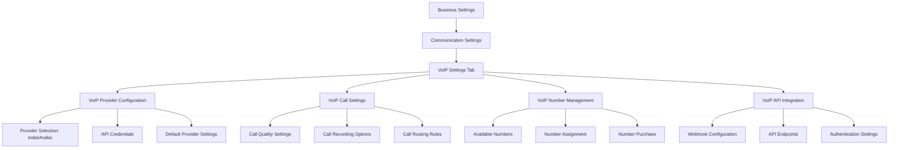
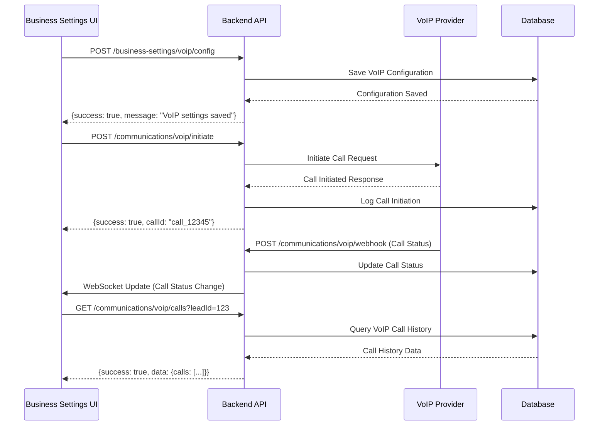
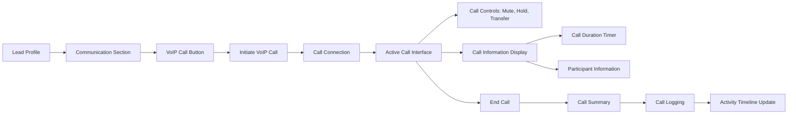

# VoIP UI Integration in Business Settings

## Overview
This document shows how VoIP features will be integrated into the business settings UI with API connections.

## Business Settings VoIP Tab

### UI Structure



## VoIP Settings UI Components

### 1. VoIP Provider Configuration
```
┌─────────────────────────────────────────────────────┐
│ VoIP Provider Configuration                          │
├─────────────────────────────────────────────────────┤
│                                                     │
│ Provider: [Twilio ▼]                                │
│                                                     │
│ Region: [India ▼] [Arabic Countries ▼]             │
│                                                     │
│ API Key: [••••••••••••••••••••]                      │
│                                                     │
│ API Secret: [••••••••••••••••••••]                   │
│                                                     │
│ Account SID: [ACxxxxxxxxxxxxxxxxxxxxxxxxxxxx]      │
│                                                     │
│ [Test Connection] [Save Settings]                  │
│                                                     │
└─────────────────────────────────────────────────────┘
```

### 2. VoIP Call Settings
```
┌─────────────────────────────────────────────────────┐
│ VoIP Call Settings                                    │
├─────────────────────────────────────────────────────┤
│                                                     │
│ Call Quality: [HD ▼]                                │
│                                                     │
│ [✓] Enable Call Recording                          │
│                                                     │
│ Recording Storage: [AWS S3 ▼]                       │
│                                                     │
│ Max Call Duration: [60 minutes ▼]                  │
│                                                     │
│ [✓] Enable Call Transfer                           │
│                                                     │
│ [Save Call Settings]                                │
│                                                     │
└─────────────────────────────────────────────────────┘
```

### 3. VoIP Number Management
```
┌─────────────────────────────────────────────────────┐
│ VoIP Number Management                               │
├─────────────────────────────────────────────────────┤
│                                                     │
│ Available Numbers:                                  │
│ +91 11 2345 6789 (India)                           │
│ +966 11 234 5678 (Saudi Arabia)                    │
│ +971 4 123 4567 (UAE)                              │
│                                                     │
│ [Assign Number] [Purchase New Number]              │
│                                                     │
└─────────────────────────────────────────────────────┘
```

### 4. VoIP API Integration
```
┌─────────────────────────────────────────────────────┐
│ VoIP API Integration                                 │
├─────────────────────────────────────────────────────┤
│                                                     │
│ Webhook URL:                                        │
│ https://yourdomain.com/api/communications/voip/webhook │
│                                                     │
│ [Copy URL]                                          │
│                                                     │
│ API Endpoints:                                      │
│ - Initiate Call: POST /voip/initiate                │
│ - Call Status: POST /voip/status                    │
│ - Call Recording: GET /voip/recording/{id}         │
│                                                     │
│ Authentication:                                     │
│ Method: [Bearer Token ▼]                           │
│ Token: [••••••••••••••••••••••••]                    │
│                                                     │
│ [Test API Connection] [Save API Settings]           │
│                                                     │
└─────────────────────────────────────────────────────┘
```

## API Integration Flow



## VoIP Call Flow in Lead Profile



## Technical Implementation Details

### API Endpoints

1. **Save VoIP Configuration**
   - `POST /business-settings/voip/config`
   - Request: `{provider: string, apiKey: string, apiSecret: string, region: string[]}`
   - Response: `{success: boolean, message: string}`

2. **Initiate VoIP Call**
   - `POST /communications/voip/initiate`
   - Request: `{leadId: number, phoneNumber: string, userId: number, callType: 'audio'|'video'}`
   - Response: `{success: boolean, callId: string, message: string}`

3. **Get VoIP Call History**
   - `GET /communications/voip/calls`
   - Query Params: `leadId, userId, page, limit`
   - Response: `{success: boolean, data: {calls: VoIPCall[], pagination: {}}}`

4. **Handle VoIP Webhook**
   - `POST /communications/voip/webhook`
   - Request: `{callId: string, status: string, duration: number, recordingUrl?: string}`
   - Response: `{success: boolean, message: string}`

### Database Schema Updates

```prisma
model VoIPConfiguration {
  id              Int      @id @default(autoincrement())
  provider        String   // e.g., 'twilio', 'agora', 'vonage'
  apiKey          String
  apiSecret       String
  accountSid      String?
  regions         String[] // ['india', 'arabic']
  isActive        Boolean  @default(true)
  createdAt       DateTime @default(now())
  updatedAt       DateTime @updatedAt
}

model VoIPCall {
  id              Int      @id @default(autoincrement())
  callId          String   @unique // External call ID from provider
  leadId          Int
  userId          Int
  phoneNumber     String
  callType        String   // 'audio' or 'video'
  status          String   // 'initiated', 'ringing', 'answered', 'completed', 'failed'
  duration        Int?     // in seconds
  startTime       DateTime?
  endTime         DateTime?
  recordingUrl    String?
  provider        String
  region          String   // 'india' or 'arabic'
  metadata        Json?
  createdAt       DateTime @default(now())
  updatedAt       DateTime @updatedAt

  lead            Lead     @relation(fields: [leadId], references: [id])
  user            User     @relation(fields: [userId], references: [id])
}
```

## UI Implementation Plan

### New Components to Create

1. **VoIPSettings.tsx** - Main VoIP settings component
2. **VoIPProviderConfig.tsx** - Provider configuration form
3. **VoIPCallSettings.tsx** - Call quality and features settings
4. **VoIPNumberManagement.tsx** - Number assignment and purchase
5. **VoIPApiIntegration.tsx** - API configuration and testing
6. **VoIPCallButton.tsx** - Button for initiating calls
7. **VoIPCallModal.tsx** - Modal for active calls
8. **VoIPCallHistory.tsx** - Call history display

### Integration Points

1. **Business Settings Page** - Add VoIP tab
2. **Lead Profile** - Add VoIP call button
3. **Communication Center** - Add VoIP call history
4. **Activity Timeline** - Show VoIP call activities

## Next Steps

The UI design and API integration plan is ready for implementation. Would you like me to proceed with creating the actual components and API endpoints?
